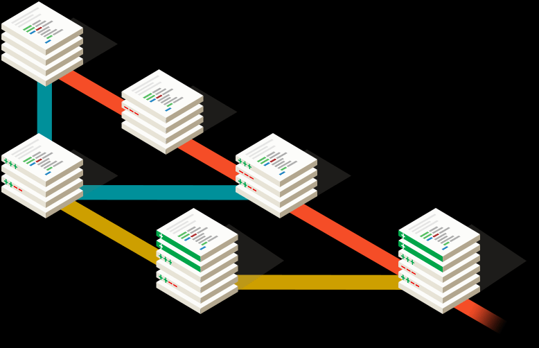

## Controle de Versão e Git

**Objetivo:**

- Compreender a importância do controle de versão.
- Aprender os conceitos básicos do Git, incluindo forks e resolução de conflitos.

### 1. O que é Controle de Versão?



O Controle de Versão é um sistema que registra as mudanças feitas em um conjunto de arquivos ao longo do tempo. Ele é essencial para colaboração em projetos de software e para o acompanhamento das alterações realizadas.

### 2. Por que usar Controle de Versão?

- 🤝🏻**Colaboração eficiente:** Permite que várias pessoas trabalhem simultaneamente no mesmo projeto, mantendo um histórico claro de quem fez quais alterações.
- 🔁 **Reversão de mudanças:** É possível voltar a versões anteriores do código caso algo dê errado.
- 🔎 **Rastreamento de alterações:** Ajuda a entender como o código evoluiu ao longo do tempo e por quais mãos passou.

### 3. Conceitos Básicos do Git

- **`Repositório`:** É o espaço onde o Git armazena as informações do seu projeto, incluindo o histórico de alterações.
- **`Commit`:** É uma "foto" instantânea de todos os arquivos do projeto em um determinado momento. Cada commit possui uma mensagem descritiva.
- **`Branch (Ramificação)`:** É uma linha de desenvolvimento independente que permite trabalhar em novas funcionalidades ou correções sem afetar o código principal. O branch principal é geralmente chamado de "master" ou "main".
- **`Merge (Mesclagem)`:** É a combinação de alterações de um branch para outro, como incorporar uma funcionalidade desenvolvida em um branch de desenvolvimento de volta ao branch principal.
- **`Fork`:** Um fork é uma cópia independente de um repositório. É frequentemente usado para contribuir para projetos de código aberto sem afetar diretamente o repositório original.

### 4. Trabalhando com commit

1. **Boas práticas:** Criar mensagens de commit claras e informativas é uma prática importante ao trabalhar com o Git. Mensagens de commit bem escritas ajudam a comunicar as alterações feitas no código, facilitam a colaboração com outros desenvolvedores e tornam o histórico do projeto mais compreensível.
    1. **Separe o título do corpo**: Uma mensagem de commit geralmente consiste em um título curto (linha única) seguido de um corpo opcional.
    2. **Título conciso e descritivo**: O título deve ser curto,
    mas ainda assim informativo. Ele deve resumir o que a alteração fez, em
    termos claros e descritivos. Use verbos no imperativo, como "Adicionar",
     "Corrigir" ou "Atualizar", para indicar a ação realizada.

        ```bash
        git commit -a -m "Inserindo um commit da forma certa"
        ```

    3. **Capitalização e pontuação**: Use letras maiúsculas no
    início da frase e evite pontuação no final do título. Por exemplo:
    "Corrigir erro de validação" em vez de "Corrigir erro de validação."
    4. **Limite o título a 50-72 caracteres**: Mantenha o título relativamente curto para que seja fácil de ler em várias interfaces e ferramentas.
    5. **Corpo explicativo (opcional)**: Se a mudança requer mais
    contexto, explique-a com mais detalhes no corpo do commit. Forneça
    informações sobre o porquê da alteração, como ela afeta o código
    existente e outros detalhes relevantes.

        ```bash
        git commit -a -m "Fazendo um commit com a estrutura correta \
        Nesse commit vamos inserir os conceitos citados acima."
        ```

    6. **Quebre linhas de forma apropriada**: Ao escrever o corpo,
     quebre as linhas em cerca de 72 caracteres. Isso facilita a leitura,
    especialmente em terminais e ferramentas de linha de comando.

        ```bash
        git commit -a -m "Corrigir erro de envio de autenticação na página de cadastro de usuários \
        O envio de autenticação na página de cadastro de usuários estava apresentando um erro que impedia o processo de criação de novas contas. \
         O problema residia na validação dos tokens JWT durante o fluxo de autenticação. Ao verificar o código, identificamos que o sistema não estava corretamente decodificando os tokens, \
         resultando em falhas constantes durante o processo de registro. \
        Para resolver esse problema, realizamos as seguintes alterações: \
        - Atualização da função de decodificação de tokens para lidar com possíveis problemas de codificação ou formato inválido.\
        - Adição de tratamento de erros apropriado em caso de falha na decodificação, garantindo que o usuário receba uma mensagem de erro clara e instrutiva.\
        Com essas mudanças, o processo de autenticação durante o cadastro de novos usuários agora ocorre sem problemas, e os tokens JWT são devidamente validados,\ 
        permitindo que os novos usuários acessem suas contas sem dificuldades."
        ```

    7. **Use uma linguagem clara e consistente**: Mantenha um
    estilo de escrita uniforme em suas mensagens de commit. Isso ajuda a
    manter o histórico do projeto limpo e fácil de entender.
    8. **Referência a problemas**: Se seu projeto utiliza um
    sistema de rastreamento de problemas (como GitHub Issues ou JIRA), é uma
     boa prática referenciar os problemas relacionados nas mensagens de
    commit. Isso ajuda a criar um link direto entre as mudanças e os
    problemas que elas resolvem.
    9. **Revisão antes de confirmar**: Antes de confirmar o commit, revise cuidadosamente a mensagem para garantir que ela seja precisa e compreensível.
2. **Mostra o histórico de commits:**

    ```bash
    git log
    ```

3. Editando os commit:
    1. Para editar o último commit no Git, você pode usar o comando `git commit --amend`. Isso permite que você adicione alterações ao último commit.

    ```bash
    **git commit --amend**
    ```

    Caso esteja usando o GitBash para finalizar o terminal de edição digite o seguinte comando:

    - O comando abaixo permitir que você saia da tela de edição sem salvar as alterações:
        1. Pressione a tecla `Esc`
        2. Digite `:q!`
        3. Pressione `Enter`
    - Se você deseja salvar as alterações feitas na mensagem de commit, digite o seguinte comando:
        1. Pressione a tecla `Esc`
        2. Digite `:wq`
        3. Pressione `Enter`
        
    <br>
    <aside>
    ⚠️ Lembre-se de que, ao usar `git commit --amend`, você está
    reescrevendo o histórico de commits. Isso pode ser problemático se você
    já compartilhou esse histórico com outras pessoas por meio de um
    repositório remoto. Portanto, tenha cuidado ao usar essa abordagem,
    especialmente em um ambiente colaborativo.

    </aside>

    b. Reorganizar e editar commits anteriores.

    ```bash
    **git rebase -i HEAD~<número-commit>**
    ```

### Comandos mais utilizados

    1. `git commit -m "Mensagem do commit"` - Realiza um commit com uma mensagem curta e descritiva.

    2. `git commit -a` - Realiza um commit de todos os arquivos modificados no diretório de trabalho, adicionando automaticamente os arquivos rastreados.

    3. `git commit --amend` - Modifica o commit mais recente, permitindo que você adicione mais alterações ou altere a mensagem de commit.

    4. `git commit -c HEAD` - Abre o editor de texto com o último commit para que você possa editar a mensagem.

    5. `git commit --fixup <commit>` - Cria um commit de correção que está vinculado a outro commit.

    6. `git commit --squash <commit>` - Combina os cambios de um commit em outro, mas permite que você edite a mensagem de commit resultante.

    7. `git commit --date="YYYY-MM-DD HH:MM:SS"` - Define uma data e hora personalizada para o commit.

    8. `git commit --no-verify` - Realiza um commit sem executar ganchos (hooks) de pré-commit.

    9. `git commit --dry-run` - Simula um commit para ver quais arquivos seriam commitados.

    10. `git commit -v` - Inclui as mudanças feitas no commit na mensagem de commit.

    11. `git commit --gpg-sign` - Assina digitalmente o commit com uma chave GPG.

    12. `git commit --all` - Realiza um commit de todos os arquivos rastreados e não rastreados.

    13. `git commit --no-edit` - Realiza um commit usando a mensagem do commit anterior sem abrir um editor de texto.

    14. `git commit --reuse-message=<commit>` - Reutiliza a mensagem de um commit anterior.

    15. `git commit --reset-author` - Realiza um commit com o autor do commit anterior.

    16. `git commit --dry-run` - Simula um commit para ver quais arquivos seriam commitados sem realmente fazê-lo.

    17. `git commit --quiet` - Suprime mensagens de saída durante o commit.

    18. `git commit --interactive` - Inicia o modo interativo para selecionar quais arquivos ou partes de arquivos incluir no commit.

    19. `git commit --message <mensagem>` - Especifica a mensagem de commit diretamente na linha de comando.

    20. `git commit --path <arquivo>` - Realiza um commit apenas para um arquivo específico.

    ---

### 5. Trabalhando com branch

- Um Git Branch (ramificações) é uma linha independente de desenvolvimento dentro de um repositório Git.
    1. **Master/Main Branch (Ramo Principal):**
        - Onde o código estável e testado é mantido. Cada commit nesse ramo deve representar um estado funcional e testado do código.
    2. **Feature Branches (Ramos de Funcionalidades):**
        - Crie uma branch separada para cada nova funcionalidade, correção de bug ou tarefa.
        - Isso isola o trabalho em progresso do restante do código, permitindo que você desenvolva, teste e refatore sem afetar a estabilidade do ramo principal.
        - Dê nomes descritivos às branches, como "feature/nome-da-funcionalidade" ou "bugfix/numero-do-bug".
    3. **Release Branches (Ramos de Lançamento):**
        - Quando você estiver se aproximando de um lançamento, crie um ramo de lançamento separado a partir do ramo principal.
        - Nesse ramo, você pode se concentrar em resolver bugs de última hora, fazer ajustes finos e preparar o código para o lançamento.
        - Não introduza novas funcionalidades nesse ramo, apenas correções de bugs.
    4. **Hotfix Branches (Ramos de Correção Urgente):**
        - Se um bug crítico for descoberto em produção, crie um ramo de correção urgente a partir do ramo principal ou da versão de lançamento correspondente.
        - Corrija o bug nesse ramo e aplique a solução diretamente à produção.
        - Mesmo que esteja trabalhando em outras funcionalidades, é importante tratar as correções urgentes imediatamente.
    5. **Pull Requests ou Merge Requests:**
        - Quando você terminar o desenvolvimento em uma branch de funcionalidade, crie um pedido de pull (no Git) ou um merge request (em sistemas como o GitLab) para mesclar as mudanças de volta ao ramo principal.
        - Isso permite revisões de código e testes antes da integração, garantindo que o código seja de alta qualidade e não introduza problemas no ramo principal.
    6. **Remoção de Branches Obsoletas:**
        - Assim que uma branch for integrada e não for mais necessária, você pode excluí-la.
        - Mantenha apenas as branches ativas e relevantes no repositório para evitar confusão.
    7. **Colaboração e Comunicação:**
        - Comunique claramente com a equipe sobre quais funcionalidades ou correções você está trabalhando e em qual branch.
        - Mantenha-se atualizado com as mudanças nas branches principais e integre as mudanças regularmente para evitar conflitos maiores.

### **Comandos mais utilizados:**

    1. `git branch` - Mostra a lista de branches locais.

    2. `git branch <nome>` - Cria um novo branch com o nome especificado.

    3. `git checkout <branch>` - Alterna para o branch especificado.

    4. `git checkout -b <nome>` - Cria e alterna para um novo branch com o nome especificado.

    5. `git merge <branch>` - Mescla as alterações do branch especificado ao branch atual.

    6. `git rebase <branch>` - Reorganiza as alterações do branch atual sobre o branch especificado.

    7. `git branch -d <branch>` - Deleta o branch especificado (se as alterações já foram mescladas).

    8. `git branch -D <branch>` - Forçadamente deleta o branch especificado, mesmo que as alterações não tenham sido mescladas.

    9. `git branch -m <novo-nome>` - Renomeia o branch atual.

    10. `git push origin <branch>` - Envia o branch especificado para o repositório remoto.

    11. `git pull origin <branch>` - Puxa as alterações do branch especificado do repositório remoto.

    12. `git branch -r` - Mostra a lista de branches remotos.

    13. `git fetch` - Puxa as informações mais recentes dos branches remotos.

    14. `git remote prune origin` - Remove referências a branches remotas excluídas.

    15. `git branch --merged` - Lista os branches que foram mesclados ao branch atual.

    16. `git branch --no-merged` - Lista os branches que não foram mesclados ao branch atual.

    17. `git log <branch>` - Mostra o histórico de commits do branch especificado.

    18. `git diff <branch1>..<branch2>` - Mostra as diferenças entre dois branches.

    19. `git push origin --delete <branch>` - Deleta o branch especificado no repositório remoto.

    20. `git checkout -t origin/<branch>` - Cria uma cópia local de um branch remoto.


### 6. Resolvendo Conflitos

- Conflitos ocorrem quando duas branches têm alterações diferentes na mesma parte de um arquivo. Isso geralmente acontece durante um merge ou pull request.

**1. Git Merge:**

Suponha que você esteja mesclando uma branch secundária (por exemplo, `feature`) na branch principal (por exemplo, `master`):

```
# Crie um novo diretório
mkdir conflito-git
cd conflito-git

# Inicialize um novo repositório Git
git init

# Crie um arquivo e faça o primeiro commit
echo "Linha 1" > arquivo.txt
git add arquivo.txt
git commit -m "Commit inicial"
```

**Crie duas branches diferentes:**

```
# Crie a branch feature e faça uma alteração no arquivo
git branch feature
git checkout feature
echo "Linha 2 da feature" >> arquivo.txt
git add arquivo.txt
git commit -m "Alteração na branch feature"

# Volte para a branch principal (master) e faça outra alteração no mesmo arquivo
git checkout master
echo "Linha 2 da master" >> arquivo.txt
git add arquivo.txt
git commit -m "Alteração na branch master"
```

Visualizar os commit

```
git log --oneline
```

**Tente mesclar a branch `feature` na branch `main` para gerar um conflito:**

```
git merge feature
```

O Git indicará os arquivos conflitantes. Abra esses arquivos no editor de código e você verá algo como:

```
Linha 1
Linha 2 da main
<<<<<<< HEAD (outras alterações na master)
Linha 2 da feature
=======
>>>>>>> feature (sua alteração na feature)
```

Você deve escolher qual código manter e qual descartar, ou fazer modificações para resolver o conflito. Após resolver todos os conflitos, adicione os arquivos e faça um commit:

```
git add <arquivo-conflitante>
git commit -m "Resolvido conflito durante a mesclagem"
```

**2. Git Rebase:**

O rebasing é outra maneira de integrar as alterações de uma branch em outra. Suponha que você esteja rebasando a branch `feature` na branch `master`.

```
# Vá para a branch feature
git checkout feature

# Rebase a branch feature na branch master
git rebase master
```

Se houver conflitos durante o rebase, siga o mesmo processo de resolução de conflitos mencionado anteriormente (editando os arquivos conflitantes, adicionando-os e fazendo um commit).

**3. Git Pull (quando trabalhando com repositórios remotos):**

Quando você puxa (pull) alterações de um repositório remoto, pode encontrar conflitos também. O Git irá notificá-lo se houver conflitos durante o `git pull`. Você pode resolver esses conflitos da mesma forma descrita anteriormente, editando os arquivos conflitantes, adicionando-os e fazendo um commit.

```
# Puxar as alterações do repositório remoto
git pull origin master
```

### Recursos Adicionais

<aside>
    


</aside>
    
